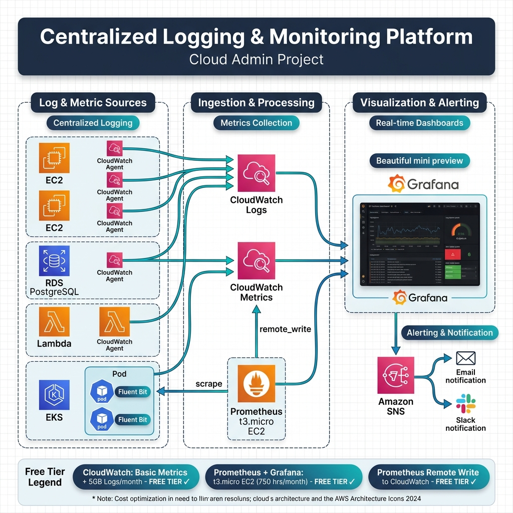

# ☁️ Centralized Logging & Monitoring Platform

> **Cloud Admin Project** — A production-grade, AWS-native centralized logging and monitoring solution built entirely within the AWS Free Tier.



---

## 📋 Overview

This project implements a **centralized logging and monitoring platform** using AWS services and open-source tools. It collects logs and metrics from multiple AWS resources, processes them through CloudWatch and Prometheus, and visualizes everything in Grafana dashboards with real-time alerting.

## 🏗️ Architecture Components

### 📡 Log & Metric Sources
| Source | Collector | Data Type |
|--------|-----------|-----------|
| EC2 Instances (×3) | CloudWatch Agent | Logs + System Metrics |
| RDS PostgreSQL | CloudWatch Agent | Database Logs + Performance Metrics |
| Lambda Functions (×2) | CloudWatch Agent | Invocation Logs + Metrics |
| EKS Kubernetes Pods | Fluent Bit (DaemonSet) | Container Logs + Pod Metrics |

### ⚙️ Ingestion & Processing
- **AWS CloudWatch Logs** — Centralized log aggregation from all sources
- **AWS CloudWatch Metrics** — Unified metrics collection and storage
- **Prometheus** (on t3.micro EC2) — Scrapes metrics from EKS and applications, remote writes to CloudWatch

### 📊 Visualization & Alerting
- **Grafana Dashboards** — Real-time graphs, log explorer, and alert panels
- **Amazon SNS** — Alert distribution hub
- **Email Notifications** — Critical alert delivery
- **Slack Integration** — Team-wide alert notifications

## 💰 Free Tier Eligibility

| Component | Free Tier Details |
|-----------|-------------------|
| ✅ CloudWatch | Basic metrics + 5 GB logs/month |
| ✅ Prometheus + Grafana | t3.micro EC2 instance (750 hrs/month) |
| ✅ Prometheus Remote Write | To CloudWatch Metrics |

## 🚀 Getting Started

```bash
# Clone the repository
git clone https://github.com/yourusername/centralized-logging-monitoring.git
cd centralized-logging-monitoring

# Deploy infrastructure (Terraform/CloudFormation)
# See /infrastructure for IaC templates
```

## 📁 Project Structure

```
├── architecture-diagram.png    # Cloud architecture diagram
├── infrastructure/             # IaC templates (Terraform/CloudFormation)
├── configs/
│   ├── cloudwatch-agent/       # CloudWatch Agent configurations
│   ├── fluent-bit/             # Fluent Bit DaemonSet configs
│   ├── prometheus/             # Prometheus server configuration
│   └── grafana/                # Grafana dashboard JSON exports
├── alerts/                     # SNS topic & alert rule definitions
└── docs/                       # Additional documentation
```

## 🛠️ Technologies Used

- **AWS CloudWatch** — Logs & Metrics
- **AWS EC2 / RDS / Lambda / EKS** — Compute & Data Sources
- **Amazon SNS** — Notification Service
- **Prometheus** — Metrics Scraping & Storage
- **Grafana** — Visualization & Dashboards
- **Fluent Bit** — Lightweight Log Shipper
- **CloudWatch Agent** — System-level Metrics & Logs

## 📄 License

This project is licensed under the MIT License — see the [LICENSE](LICENSE) file for details.

---

<p align="center">
  <b>Built with ☁️ by Cloud Admin</b>
</p>
